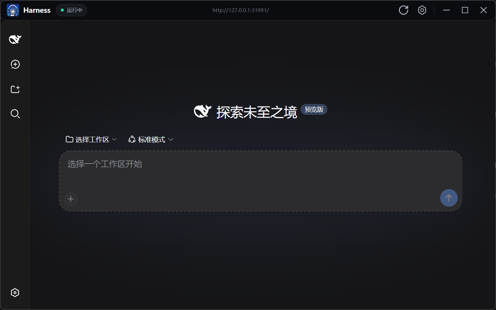

<div align="center">
  
  <h1>DeepSeek Harness Desktop</h1>
  <p>A Windows desktop shell and local management center for DeepSeek Harness</p>
</div>

[中文](README.md) · [Download the prerelease](https://github.com/jinganwushideng/deepseek-harness-desktop/releases/tag/v1.1.1)

> [!IMPORTANT]
> This is an unofficial community project. It is not affiliated with or endorsed by DeepSeek. DeepSeek, DeepSeek Harness, and related names belong to their respective owners.



## Features

- Starts a local DeepSeek Harness server automatically and opens its Web UI inside WebView2.
- Bundles self-contained .NET, Node.js 24, pnpm, and an offline Harness runtime.
- Light and dark shell themes, system tray support, Windows completion notifications, and crash recovery.
- Management pages for the server, updates, plugins, Skills, logs, diagnostics, data, and encrypted backups.
- Automatic checks for desktop GitHub Releases and Harness npm versions. Checks only show a prompt and never install silently; they can be disabled in Settings. Dismissal is remembered for that release only.
- Keeps official plugins separate from user-installed packages; user CLI/Skill packages live in an isolated `launcher-packages` directory.
- A dedicated skin center keeps community skins out of the regular plugin list and can optionally synchronize the shell's light/dark state and semantic colors while repairing unsafe low-contrast palettes.
- The installer includes the Deep Whale day/night skin and DeepSeek Harness Themes for offline first-run selection. Each can be enabled, kept disabled, or removed; both default to disabled and no more than one is enabled.
- The self-updating catalog performs paged npm/GitHub, dependency, topic, and manifest discovery; it prefers Chinese README summaries and verifies every Harness manifest.
- Repository cards prefer project preview images and fall back to the bundled whale-girl artwork. Images are loaded in visible/preload/on-demand tiers and card text uses recycling virtualization.
- A daily auto-discovered npm/GitHub catalog provides Chinese-first summaries and one-click installs after validating Harness manifests.
- Official endpoints use the system proxy; network failures retry through a China-accessible mirror with proxy bypassed for the mirror connection.
- Listens on `127.0.0.1` only and does not expose a LAN service.

## Install

1. Download `DeepSeek-Harness-Desktop-Setup-1.1.1.exe` from [Releases](https://github.com/jinganwushideng/deepseek-harness-desktop/releases).
2. Run the installer. It installs per user to `%LOCALAPPDATA%\Programs\DeepSeek Harness Desktop` and does not require administrator rights.
3. On first launch, select a workspace, DSH_HOME, and local port, then configure model API keys as needed.

The installer is currently unsigned, so Windows SmartScreen may show an unknown-publisher warning. Download only from this repository and verify it against `SHA256SUMS.txt`.

### Requirements

- Windows 10 version 2004 or newer / Windows 11, x64.
- Microsoft Edge WebView2 Runtime. It is normally present on Windows 11 and fully updated Windows 10 systems.
- Network access for model calls, online updates, and network plugin installation.

You do not need to install .NET, Node.js, npm, or pnpm separately.

## Data and privacy

- Harness data defaults to `%USERPROFILE%\.dsh`; a different DSH_HOME can be selected during setup.
- API keys are not stored in `launcher.json`, are never displayed in plaintext, and are redacted from logs.
- Uninstall keeps DSH_HOME, `launcher.json`, and backups by default so sessions, credentials, and user plugins are not removed.
- WebView2 browser data is stored separately from Harness data.

## Build from source

.NET 10 SDK, PowerShell, and NSIS 3.12 are required. The runtime seed is not stored in Git; it is downloaded from the matching Release and verified before packaging.

```powershell
git clone https://github.com/jinganwushideng/deepseek-harness-desktop.git
cd deepseek-harness-desktop

.\scripts\prepare-runtime.ps1
.\scripts\prepare-featured-skins.ps1
dotnet test .\DeepSeekHarnessDesktop.Tests\DeepSeekHarnessDesktop.Tests.csproj -c Release
.\Installer\build-installer.ps1
```

`runtime.seed.zip` and the featured-skin payloads are not required for compilation or unit tests. The packaging script prepares and verifies them for an offline first launch. Bundled skins retain their upstream licenses; see the third-party notices.

`catalog/plugin-index.json` is refreshed daily by `.github/workflows/plugin-catalog.yml` through `scripts/update-plugin-catalog.mjs`. Manifest validation proves compatibility structure, not a security audit; users should still review the source and lifecycle-script warning before installation.

## Contributing

Read [CONTRIBUTING.md](CONTRIBUTING.md) before opening an issue or pull request. Report security problems privately as described in [SECURITY.md](SECURITY.md).

## License

The desktop shell source and declared project assets are licensed under the [MIT License](LICENSE). Bundled runtimes and dependencies retain their own licenses; see [THIRD_PARTY_NOTICES.md](THIRD_PARTY_NOTICES.md) and [ASSETS.md](ASSETS.md).
